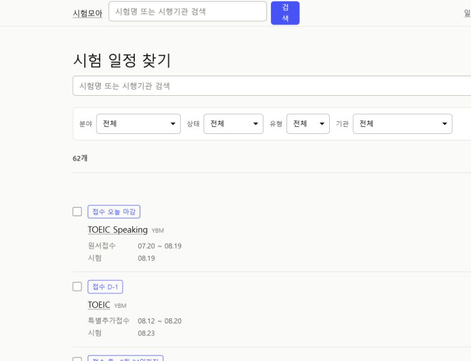
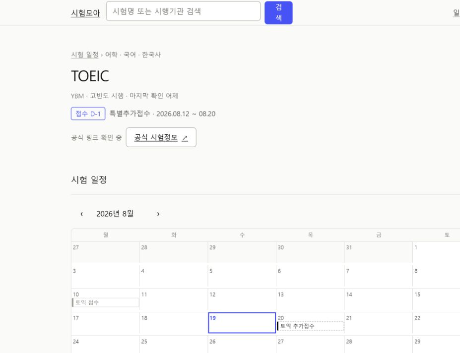
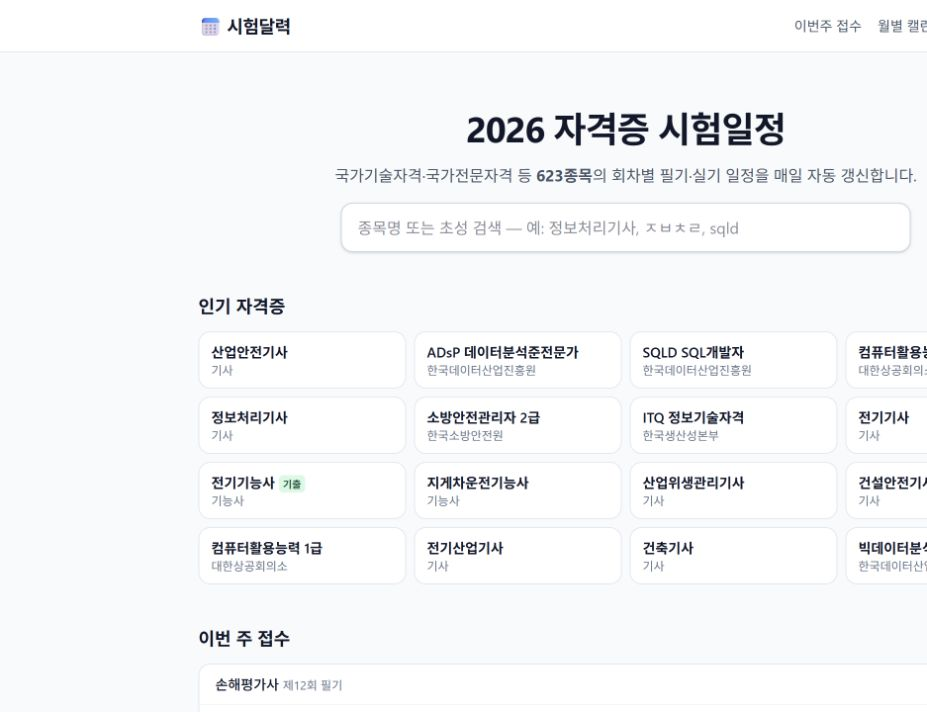
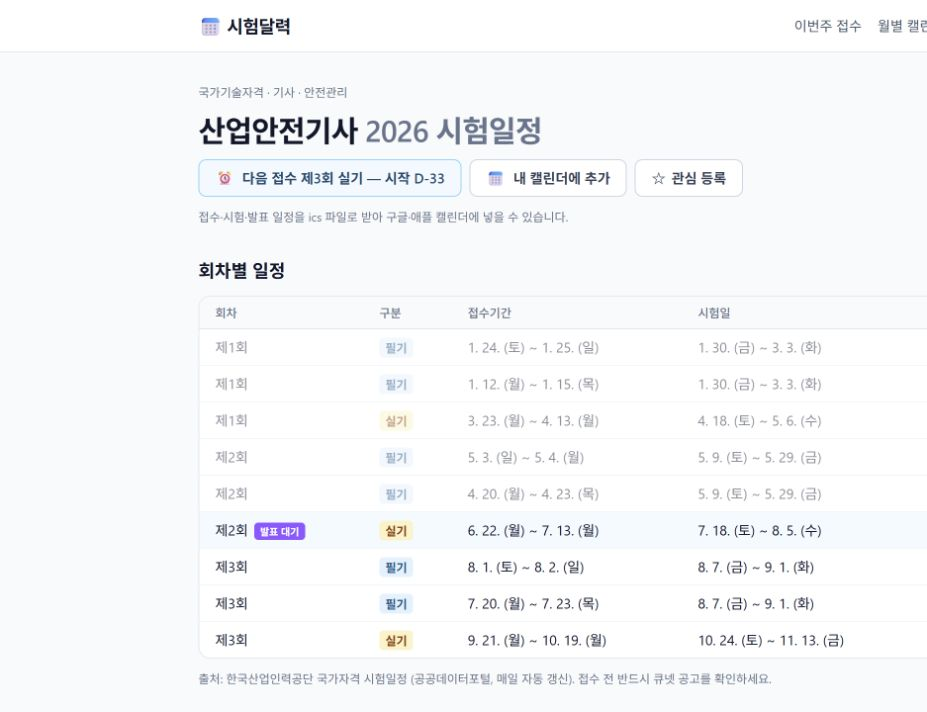
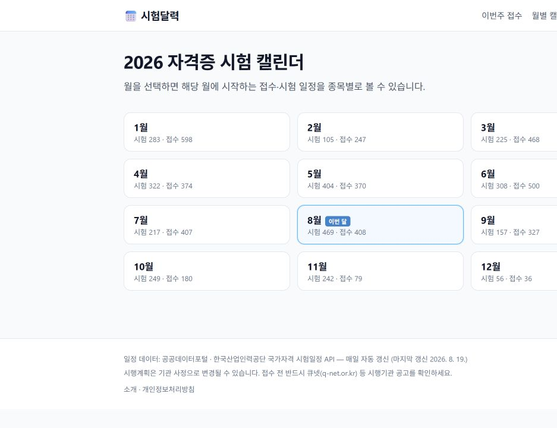
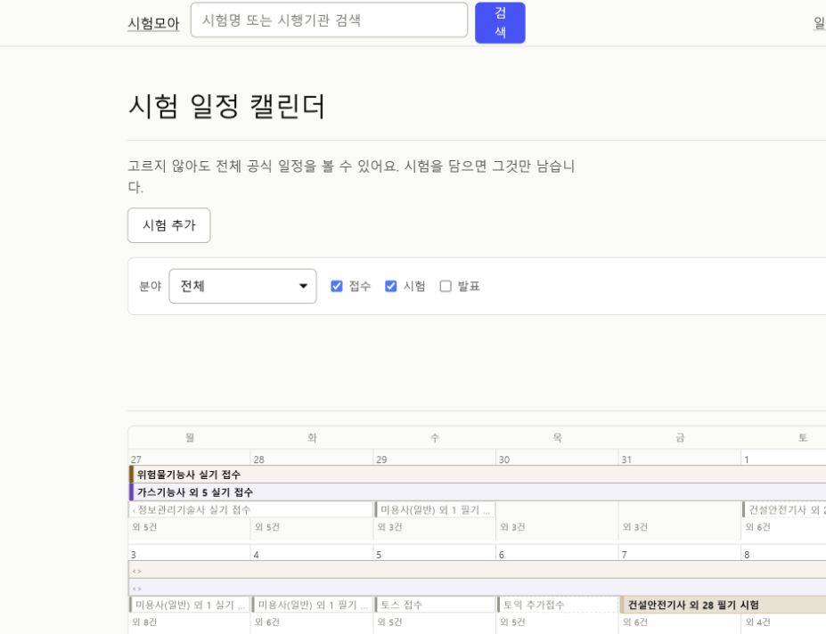

# 시험모아 UI/UX 감사와 전면 개편 계획

- 작성일: 2026-08-19
- 비교 대상: `https://all.exammoa.workers.dev`, `https://examcal.kr`
- 핵심 사용자 목표: 시험을 찾고, 지금 접수 가능한지와 다음 일정을 확인한 뒤, 공식 기관으로 이동한다.
- 접근성 목표: WCAG 2.2 AA. 이 문서는 화면과 DOM을 기준으로 한 위험 평가이며 완전한 준수 판정은 아니다.

## 감사 단계

### 1. 시험모아 홈 — 보통

- 서비스 목적, 검색, 상태별 바로가기는 명확하다.
- 927px 안팎의 중간 폭에서 헤더 메뉴와 목록 우측 행동이 잘리고 빈 공간이 커진다.
- 검색 버튼 글자가 두 줄로 갈라지고, 62개 시험과 9개 출처라는 실제 가치가 첫 화면에서 충분히 드러나지 않는다.

### 2. 시험모아 일정 찾기 — 개선 필요

- 검색·분야·상태·유형·기관 필터가 있고 URL 상태와 연결되어 탐색 기능은 강하다.
- 결과 한 행이 화면 왼쪽에만 몰리고 공식 행동이 첫 시야에서 사라진다.
- 체크박스의 목적이 목록 첫 진입에서 바로 이해되지 않고, 필터·정렬·선택 비교가 한 화면에서 경쟁한다.

### 3. 시험모아 상세 — 보통

- 상태, 다음 일정, 공식 링크, 출처가 상단에 있어 신뢰 흐름이 좋다.
- 월간 달력이 상세의 주 표현이라 여러 회차를 빠르게 비교하기 어렵다.
- 날짜순 일정표가 접혀 있어 사용자가 가장 익숙한 표 형식이 늦게 발견된다.

### 4. 시험달력 홈 — 보통 이상

- 연도·종목 수·자동 갱신을 한 문장에 담아 서비스 규모를 빠르게 전달한다.
- 검색 바로 아래 인기 종목 카드가 탐색 시작점을 제공한다.
- 기본 폭에서는 카드가 가로로 잘리고, 인기 기준이 보이지 않으며 이번 주 접수 목록이 지나치게 길다.

### 5. 시험달력 상세 — 좋음

- 다음 접수, 캘린더 추가, 관심 등록을 상단에 모았다.
- 회차별 표가 필기·실기·접수·시험·발표를 빠르게 비교하게 한다.
- 동일 회차의 중복 행 구분이 약하고, 공식 접수처로 이동하는 행동은 시험모아보다 덜 선명하다.

### 6. 시험달력 월 선택 — 좋음

- 12개월을 단순한 카드로 요약해 사용자가 먼저 월을 고르게 한다.
- 각 월의 시험·접수 건수가 밀도를 예고한다.
- 실제 월간 일정으로 한 단계 더 들어가야 하므로 오늘의 급한 일정을 바로 보는 데는 불리하다.

### 7. 시험모아 통합 캘린더 — 보통

- 접수·시험·발표를 구분하고 시험을 골라 비교하는 기능은 차별점이다.
- 기본 전체 일정은 한 칸에 정보가 많아 첫 진입 난도가 높다.
- 중간 폭에서 월 이동과 핵심 맥락이 첫 화면에 보이지 않고 달력 전에 빈 공간이 크게 느껴진다.

### 8. 시험모아 모바일 홈 — 보통 이상

- 검색, 바로가기, 공식 링크가 390px에서 한 열로 재배치된다.
- 헤더에 네 개 링크가 남아 터치·가독 밀도가 높고, 검색 버튼의 줄바꿈이 어색하다.
- 첫 시험의 공식 행동이 명확한 점은 유지해야 한다.

### 9. 시험달력 모바일 홈 — 좋음

- 두 열 카드와 짧은 보조 문구로 많은 종목을 안정적으로 보여준다.
- 가로 넘침 없이 서비스 규모와 검색이 첫 화면에 들어온다.
- 긴 카드 목록은 사용자가 원하는 종목을 찾기 전에 피로를 만들 수 있다.

## 유지할 시험모아의 강점

1. 공식 기관 링크가 사용자 여정의 종착점이다.
2. 출처·수집일·오래된 데이터 상태를 숨기지 않는다.
3. 분야·상태·기관·유형 필터와 URL 공유가 이미 구현되어 있다.
4. 시험 선택 비교와 기간형 월간 달력은 단순 일정표보다 강한 기능이다.
5. 랜드마크, 레이블, 표, 포커스 링 등 기본 접근성 구조가 비교적 충실하다.

## 가장 큰 개선 기회

1. **중간 폭 반응형 복구:** 768~1024px에서 헤더, 검색, 목록 CTA, 달력이 잘리지 않게 한다.
2. **첫 화면 가치 강화:** 실제 시험 수·출처 수·현재 접수 건수와 자동 갱신을 검색 근처에 간결하게 표시한다.
3. **탐색 밀도 재설계:** 인기 종목을 임의로 만들지 말고 최근 검색 또는 대표 종목 규칙을 정해 카드형 진입점을 제공한다.
4. **상세 정보 우선순위 변경:** 다음 행동 요약 → 회차별 일정표 → 월간 달력 → 출처 순으로 재배치한다.
5. **캘린더 이중 보기:** 데스크톱 월간 격자는 유지하되 모바일과 첫 진입에는 날짜순 목록을 동등한 보기로 제공한다.
6. **컴포넌트 상태 정리:** 검색, 필터, 배지, 버튼, 빈 상태, 오래된 데이터, 로딩·오류 상태를 디자인 시스템에 명시한다.

## 제품 방향: 공연 캘린더의 탐색성 + 자격시험의 다음 행동

공연·뮤지컬 캘린더에서 차용할 것은 장식이 아니라 `월을 훑고 → 날짜를 고르고 → 해당 날짜의 항목을 자세히 보는` 정보 구조다. 시험모아에서는 이를 다음처럼 바꾼다.

- 데스크톱: 월간 격자와 선택한 날짜의 일정 패널을 함께 보여준다.
- 모바일: 월간 격자를 억지로 축소하지 않고 날짜 스트립과 날짜순 일정 목록을 기본으로 한다.
- 날짜 칸에는 시험명을 모두 넣지 않고 `접수 3 · 시험 1 · 발표 2`처럼 밀도만 먼저 보여준다.
- 날짜를 선택하면 시험명, 기관, 일정 유형, 남은 기간, 공식 사이트 행동을 목록으로 펼친다.
- 색상만으로 접수·시험·발표를 구분하지 않고 텍스트 레이블과 형태를 함께 사용한다.
- 상세 화면은 달력보다 `다음 행동 요약 → 회차별 일정표 → 캘린더` 순서를 유지한다.

핵심 진입점은 사용 목적에 맞춰 세 가지로 제한한다.

1. **지금 접수할 시험 찾기:** 현재 접수 중이거나 곧 접수하는 시험을 날짜순으로 확인한다.
2. **관심 시험 일정 비교:** 선택한 시험만 겹쳐 보고 접수·시험·발표 충돌을 확인한다.
3. **취득한 자격 관리:** MVP 이후 로그인 사용자가 취득일·유효기간·증명서 사본을 관리한다.

## 제품 단계와 정보 구조

### 1단계: 공개 일정 MVP

- 상단 내비게이션: `시험 찾기 / 시험 캘린더`
- 홈: 검색, 현재 접수 건수, 이번 주 마감, 관심 분야 진입
- 캘린더: `월 요약 / 날짜순 목록` 전환, 접수·시험·발표 필터, 선택 비교
- 상세: 다음 일정, 회차별 표, 공식 링크, 출처·갱신일
- 계정과 개인 문서 저장은 포함하지 않는다. 일정 탐색의 사용성을 먼저 검증한다.

### 2단계: 내 자격 베타

- 로그인 후 `내 자격`을 별도 최상위 영역으로 추가한다.
- 자격 항목: 자격명, 발급기관, 취득일, 유효기간, 갱신일, 메모
- 대시보드: 보유 자격, 만료 임박, 갱신 필요, 관련 시험 일정
- 알림: 만료 90/30/7일 전 등 사용자가 선택한 시점에 제공한다.
- 공개 시험 데이터와 개인 자격 데이터를 화면·저장소·권한에서 분리한다.

### 3단계: 증명서 사본 관리

- 이미지/PDF 업로드, 미리보기, 교체, 다운로드, 완전 삭제를 제공한다.
- 증명서 파일은 민감정보가 포함될 수 있으므로 일반 일정 MVP와 분리해 설계한다.
- 구현 전 암호화 저장, 제한된 다운로드 URL, 접근 권한, 파일 검사, 보관·삭제 정책, 백업 범위를 확정한다.
- 파일 업로드를 시작하기 전에 개인정보 처리 안내와 사용자의 명시적 동의 흐름을 검토한다.

1단계의 사용 지표가 확보되기 전에는 2·3단계를 MVP에 섞지 않는다. 우선 확인할 지표는 검색 성공률, 공식 사이트 이동률, 캘린더 날짜 선택률, 선택 비교 사용률이다.

## 실행 로드맵

### P0. 개편 기준과 반응형 기반

- `docs/reference/디자인-시스템.md`와 `화면정의-전체.md`를 먼저 갱신한다.
- 390 / 768 / 1024 / 1440px 레이아웃 기준, 최대 폭, 헤더 모드, 타이포 스케일을 확정한다.
- 헤더는 데스크톱 검색형, 태블릿 축약형, 모바일 메뉴형으로 나눈다.
- 완료 기준: 전 핵심 화면에서 가로 스크롤과 잘림이 없고, 200% 확대에서도 핵심 행동이 유지된다.

### P1. 공통 셸과 검색

- 워드마크·검색·주요 메뉴의 우선순위를 재설계한다.
- 두 글자 자동완성에 시험명, 기관명, 현재 상태를 표시한다.
- 검색 버튼의 최소 폭과 접근성 이름을 고정하고 모바일에서는 아이콘 또는 한 줄 문구로 유지한다.
- 완료 기준: 홈에서 검색 결과 또는 공식 정보까지 두 번 이내 행동으로 도달한다.

### P2. 홈 전면 개편

- 히어로를 `무엇을 제공하는가 + 실제 범위 + 검색` 구조로 압축한다.
- 상태 바로가기는 유지하되 현재 건수를 붙인다.
- 대표 종목 카드, 이번 주 마감, 분야별 탐색을 짧은 모듈로 구성한다.
- 캘린더 전체 격자는 홈에서 제거하거나 이번 주 요약으로 줄이고 전체 캘린더로 연결한다.
- 완료 기준: 첫 화면 안에 서비스 범위, 검색, 현재 접수 진입점이 모두 보인다.

### P3. 일정 찾기 개편

- 검색과 필터를 한 개의 탐색 도구로 합치고 모바일 필터 시트를 제공한다.
- 적용 중인 조건, 결과 수, 초기화, 정렬을 같은 영역에 둔다.
- 시험 행은 `상태 → 시험·기관 → 다음 접수/시험 → 공식 CTA`의 일정한 구조로 만든다.
- 캘린더 담기는 체크박스 대신 의미가 드러나는 `비교에 담기` 동작으로 바꾼다.
- 완료 기준: 사용자가 현재 필터와 다음 행동을 한눈에 설명할 수 있다.

### P4. 상세 개편

- 상단에 다음 접수·시험·발표와 공식 CTA를 하나의 요약 영역으로 배치한다.
- 회차별 일정표를 기본으로 보이고 월간 달력은 보조 보기로 제공한다.
- `내 캘린더에 추가(.ics)`는 브라우저 저장만 사용하는 선택 기능으로 검토한다.
- 출처, 마지막 확인일, 이전 데이터 유지 상태는 표 가까이에 둔다.
- 완료 기준: 모바일 첫 화면에서 시험명, 상태, 다음 날짜, 공식 CTA가 보인다.

### P5. 통합 캘린더 개편

- 첫 진입에 공연 캘린더처럼 이번 달의 밀도를 먼저 보여주고, 격자와 날짜순 목록을 전환할 수 있게 한다.
- 데스크톱은 `월간 격자 + 선택 날짜 패널`, 모바일은 `날짜 스트립 + 일정 목록`을 기본 조합으로 한다.
- 선택 비교 모드와 전체 일정 모드를 시각적으로 구분한다.
- 모바일은 일정표를 우선하고 월간 격자는 확대·스크롤 없이 읽을 수 있는 정보량으로 줄인다.
- 완료 기준: 접수·시험·발표의 차이를 색 없이도 이해하고 키보드만으로 날짜 상세를 열 수 있다.

### P6. 접근성·품질·출시

- 키보드 전체 흐름, 포커스 복귀, 200% 확대, 다크 모드, `prefers-reduced-motion`, 스크린리더 이름을 검증한다.
- 정상·빈 결과·일정 미공고·오래된 데이터·오프라인·404 상태를 시각 회귀 테스트에 포함한다.
- PR은 `디자인 문서/토큰 → 셸/홈 → 탐색 → 상세 → 캘린더 → 접근성 QA`로 나눈다.
- 완료 기준: 기존 데이터·SEO·프리렌더 테스트를 유지하고 각 PR의 Cloudflare Preview에서 데스크톱·모바일을 확인한다.

## 측정 기준

- 390 / 768 / 1024 / 1440px에서 가로 넘침 0건
- 공식 사이트 이동까지 최대 2회 행동
- 홈 첫 화면에 검색·서비스 범위·현재 접수 진입점 노출
- 상세 모바일 첫 화면에 상태·다음 일정·공식 CTA 노출
- 모든 입력에 레이블, 모든 상태 변화에 텍스트 설명, 모든 핵심 조작에 키보드 접근
- 기존 테스트와 프리렌더, canonical, sitemap, 404 동작 유지

## 증거 한계

- 스크린샷과 DOM으로 구조와 시각 위험을 확인했지만 실제 사용자 조사와 분석 데이터는 없었다.
- 키보드 포커스 순서, 스크린리더 발화, 200% 확대, 실제 기기 터치는 구현 단계에서 별도 검증해야 한다.
- 시험달력의 인기 종목 선정 기준과 운영 지표는 공개 화면만으로 확인할 수 없다.
